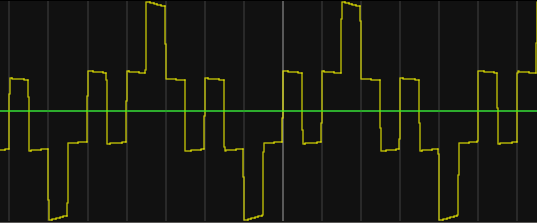

# The search for Inductance

Okay, after flailing around watching entirely too many hours of YouTube on [control systems and bode
plots](https://www.youtube.com/watch?v=O2Cw_4zd-aU&list=PLUMWjy5jgHK1NC52DXXrriwihVrYZKqjk&index=12),
it looks like I'm going to need to accurately measure the motor's inductance.

I initially tried to do this with a simple RL time constant using a battery and another winding, but
that was unsatisfactory. Going to attempt to do what ODrive does and drive a zero-centered square
wave through the phases, which should [result in a triangle wave of current through the
inductor](https://www.falstad.com/circuit/circuitjs.html?ctz=CQAgjCBMCmC0AcIBsBOAdAZgCxbBgrGAAxbZhL5QoiX5E1xhgBQA7iFvPVikiAZA68QRZuXpIs3cjRwcZ9ImiIqIxFRs1sOXDitlY9i5gBtkU+XwDsJSyJHLNKZy9dvqsMFbRWpReJCSBGCQWIKiAE4gNoa41viCcfZKRJDaVglCfPhyPHyi7DmxwpzcwgUGWZWk4cwA5vyZeY2CCYjG7BmJMl1VogBKOtz6NUb2glz6ockO+MwA9iDUkvYhkCgQKaogAT5WVij+qVhI2Lb0gtQYzEA). Measuring current over time should give us the inductance via $V=L\frac{di}{dt}$. This appoximation holds as long as the square wave duration is $\llless$ inductor time constant $\tau$.

But this gets a little dicey though, since we don't want to drive +/- 24V through the windings;
that'd burn up the stator in no time flat. So we're going to have to PWM it, which results in some
[really gnarly
waveforms](https://www.falstad.com/circuit/circuitjs.html?ctz=CQAgjCBMCmC0AcIBsBOAdAZgCxbBgrGAAxbZhL5QoiX5E1xhgBQA7iFvPVikiAZA68QRZuXpIs3cjRwcZ9ImiIqIxFRs1sOXDitlY9i5gBtkU+XwDsJSyJHLNKZy9dvqsMGklYkGSPBYkEyQ+ChWlKIATiA2hrjW+IIJ9kpEkNoRycL4cjx8ouy58cKc3MKiAEo0KMn+NYIC9smaNKkOKHSa3RosRXk5efWiAOb8SUJ8TUmIxuxZdgv5IszVZUYc9VKKUOCQGlCGO0r4zAD24BJHe5AoEGmqHGj4L8SoVkiQOEhEkbvE-GYQA):

That's apparently ... okay? Some back of the envelope calculations from
[Falstad](https://www.falstad.com/circuit/circuitjs.html?ctz=CQAgjCBMCmC0AcIAskB0AGArATgMxKXTEnV3l1ymxExvRrjDACgB3ZeepbANhF0yRkvEOmZge9HoWQSaBWX3roM6IuDWatY9kk7I18pAeXMANiGlc5AdnTGkc5arWRs7j5682QsMKkxuXGwbSTBseDB4TBtEMQAnEDsHW0FFUVFUSDYktO4+QIcRHSNhPj0uYuYAJRpsISRcIRwhASF6Bq0aDOdsCR4B7S0WdkKy0sb25gBzfjyRNppIONEcmzzUhqraipNkJr2OjU0oY2VMzGYAew1LM-BINwgVTQh-GwibUJ5sRvh1nxHMD0XDXfh3DKEdwGSyoe6tfjMIA)
suggest something like a 40kHz PWM taking voltage down to ~2V (8.33% duty cycle) and a square wave
at 10kHz keeps the peak current under 2A but gives a fairly decent approximation:

$$I_{peak}=1.772A$$
$$L=\frac{V}{\frac{di}{dt}}=\frac{V_{bus}}{\frac{I_{peak}}{\Delta t}}=\frac{2}{\frac{1.772}{\frac{1}{40000}}}=28.2*10^{-6}=28.2\mu H$$

That's about 6% error, which can likely be attributed to the unpowered loss through the resistor (?). At least I know we're not off by an order of magnitude or two.

Okay, here goes nothing... going to try to get the control loop to pulse a square wave through the motor by toggling between phase A high and B/C low, and B/C high and A low.

- Going for control loop of 40kHz and square wave of 10kHz
- Aaaand getting `nFAULT` from DRV8323. Not a big surprise, but checking to see what's going on
  - I suspect it might be because I'm not in release mode, which means toggling the timer hardware may not be fast enough
