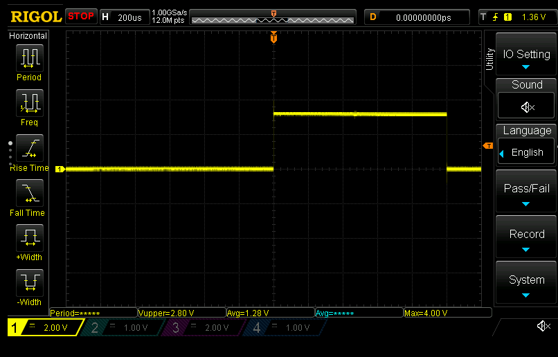
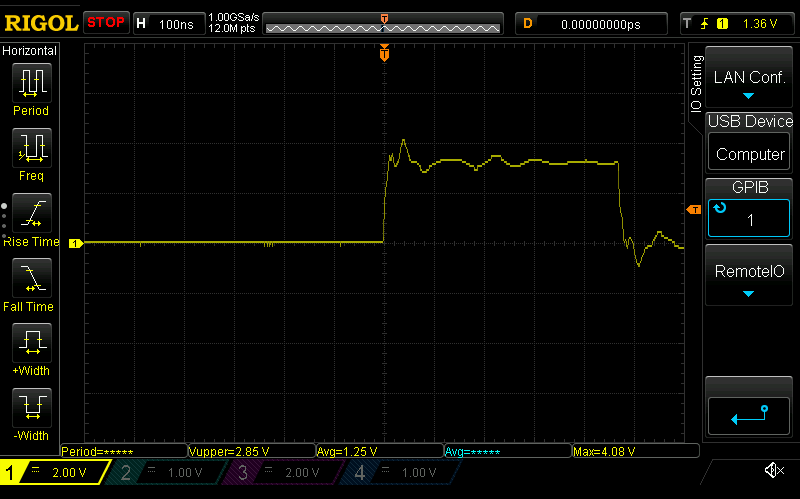

## Release mode

Seeing some weirdness in release mode: looks like the DRV chip doesn't want to wake up. I'm seeing execution being blocked by `block_while! { spi.sr.read().bsy().bit_is_set() }` when trying to read a DRV register.

Hm, that's annoying. Seems like sometimes it gets stuck there, sometimes it continues on...?

Okay, fixed one issue where I was polling SPI too quickly after turning on the DRV, which caused the `BSY` bit to hang waiting for the reply from the DRV.

I really need to move the systick timer into a globally available instance; passing it around seems like a bad idea.
- Global singletons are bad, m'kay? But in this case since it's blocking we should be okay.
- Oh, wait. If I don't declare it `pub` and instead use it from a wrapper, then there's absolutely no way for it to escape
- Rust never ceases to amaze me 

Okay, so doesn't seem like it's a wake-up issue. I've sprinkled `blocking_sleep_us` everywhere I can and can't seem to coax the DRV to do anything as yet.

Blocking sleep doesn't seem to be an issue anymore, since sleeping for $1000\mu s$ results in a sane sleep time: 

The timer does appear to be firing on schedule (should be ~470.5ns):
E
