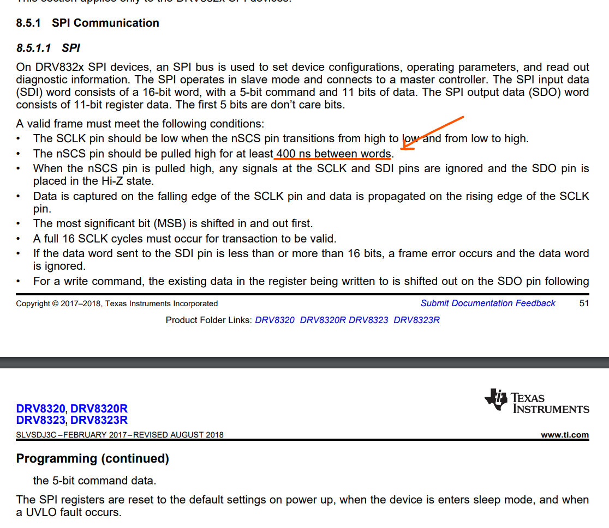

## The case of the sleepy DRV

Solved the DRV wakeup issue! **TL;DR:** Rust made my program run too fast

Well that was an odd bug to fix. DRV worked fine in debug mode but didn't want to wake up in release mode. Probing SPI lines showed the MOSI line transmitting data just fine.

But what was strange was the first frame's MISO line read correctly, but subsequent frames - including writes - just showed 0s, which was super odd.

I put in a blocking_sleep_us(20) in between each individual DRV register update (consisting of a read/write operation pair), and suddenly every read worked, but the update wasn't returning the register's value correctly.

Turns out even at 5MHz SPI clock the time between pulses was longer than the time between frames.

Looking at the DRV data sheet:

Huh. I guess my register updates were going so fast in release mode that the combination of nSCK pin going HI-Z (in hardware mode) and the 1k pullup on the DRV_CS resulted in the DRV_CS pin not staying high for long enough between frames

I put a 1us sleep before each read/write (I'm not polling during the control loop, so blocking is fine), and bingo, works in release mode now!

Now that I look at it, I should probably move the calibration/startup code into the DRV struct. Let's do that.
