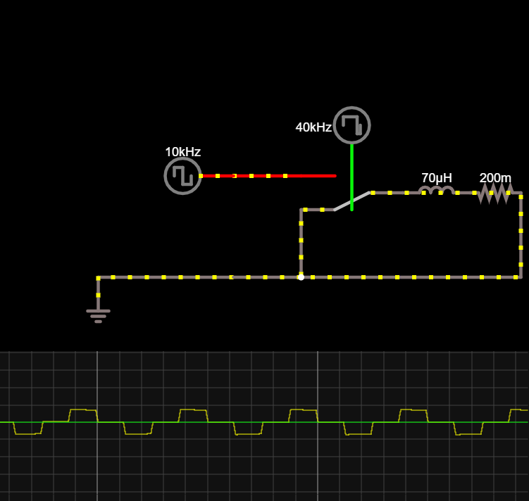
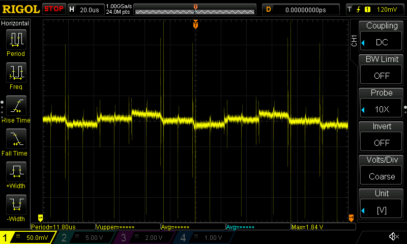
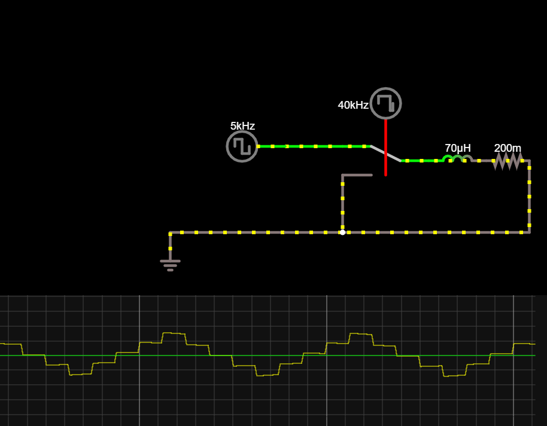
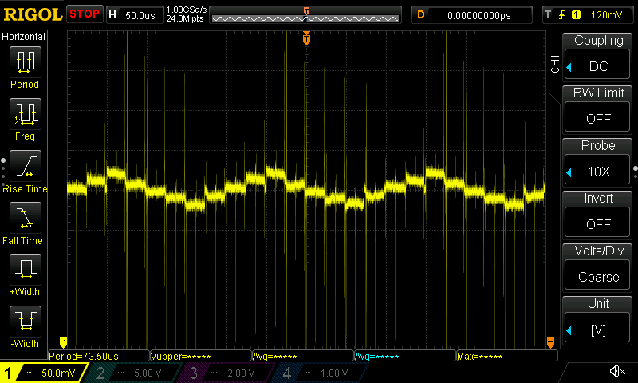
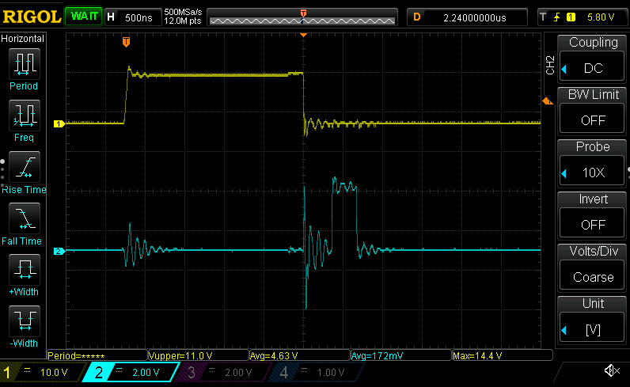
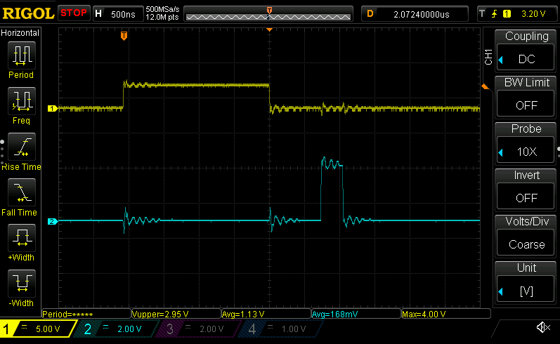
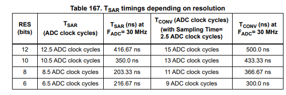

# Measuring inductances

So figured out why my current loops were all wonky. Turns out my [loop variables](./20210819.md)
weren't being handled correctly. :facepalm: On the plus side, my current measurements look somewhat
close to my [Falstad
simulation](https://www.falstad.com/circuit/circuitjs.html?ctz=CQAgjCBMCmC0AcIAskB0AGArATgMxKXTEnV3l1ymxExvRrjDACgB3ZeepbANhF0yRkvEOmZge9HoWQSaBWX3roM6IuDWatY9kk7I18pAeXMANiGlc5AdnTGkc5arU3RqAbh7EkuG-EhIeDB-NzEAJxA7B1tBRVF3SDYouO4+TAU00WSMhxE9LhExACUabCFfIRwhASF6Cq0aBOdsCR527S0WdlzhdMzcOuYAc35UkVqaIObkm1TYiqLmUoKTZEG1+qhGyGNld0xmAHsNEER6AA9yIkoVTQgVPxDcLDnW4iZqLbu1Wnowei3VB-Y78M4JQjYagyXCoOpQMG4ZhAA)
when toggling at 20kHz (yellow trace is current):

And the current measured across the resistor, toggling phase A high B//C low, then vice versa:

So trying to generate a square wave now, but it looks like I'm losing a variable inside of a closure
somewhere...
- I set `let mut sign = -1f32` before the control loop, and do a `sign = -sign` to invert it every iteration
- Oddly, by the time it gets into the loop, `sign` is `0` ?!
- I wonder if this has to do with how I'm munging the callback in the `IRef`, potentially blowing away the vtable
- Okay, initially the memory address of `sign` is `0x20017fcc`, and inside the loop it's... `0x20017fd4`. That doesn't seem right
- But if I assign it to a `static mut`, the location goes back to `0x20017fcc` as expected...???
- Sounds suspiciously like UB
- Okay, well I guess for now I'll

And we've got a "triangle wave". At least it matches with the sim at 10kHz:

And at 5kHz (note: had to turn it down to 12V here since we're driving a bit more current than I'm comfortable with here):

Getting the inductance measurement up now. Headphones = required... the 10kHz whining is _really_ annoying...

Beginning to realize I don't particularly like the API I'm using for the different commutation loops... I'm imagining something new along the lines of `.commutation(fn_ptr)` or something along those lines.

Getting current sampling timing going with the square wave generation. Need to coordinate sampling time with the end of the pulse. That required tweaking `TIM1[CH4]` to be the _inverse_ of the other channels; when others go low (end of PWM signal and corresponding current surge during the square wave), CH4 goes high.

Yellow pulse is winding voltage (what induces the current on across the resistor), and blue is when sampling has finished and we've entered the ADC interrupt handler and pulsed a GPIO.

Actually, that seems a bit _too_ good to be true. Putting the trigger point at the _exact_ inverse signal of the PWM means there's about ~356ns between the falling edge and the rising one of GPIO pulse. Yeah, 6 clock cycles is ***way*** too fast.

Wait, no it's not; [PEBKAC](https://en.wikipedia.org/wiki/User_error). Turns out at 170MHz each clock is 5.88ns, not 58 :zany_face:. In that case it's about 60.5 cycles between the beginning of the sampling and the end of conversion, and given we're running with an ADC freq of $F_{core}/4$ and conversion takes 2.5 ADC cycles, that results in $356ns * \frac{4}{170e6}\approxeq15\ ADC \ cycles$. That's _just_ enough time to sample and get into the interrupt handler.

But wait, key point: that's measured from the _phase_ voltage, not from the PWM signal. The $\Delta t$ between the PWM edge and the GPIO edge is... _drumroll_... about 720ns:

It takes 500ns to convert:

That leaves us with 220ns to distribute. At 5.88ns per clock cycle, that gives... 37.4 clock cycles between EoC and GPIO pulse. That's about 30 clock cycles shorter than I've been able to record before, so taking into account the slew time of both the DRV gate drive output and the FETs, we'll probably need to delay the measurement by at _least_ 30 clock cycles.

More on that tomrorow :sleepy:
