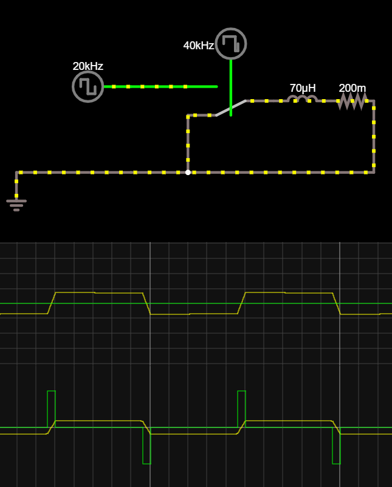
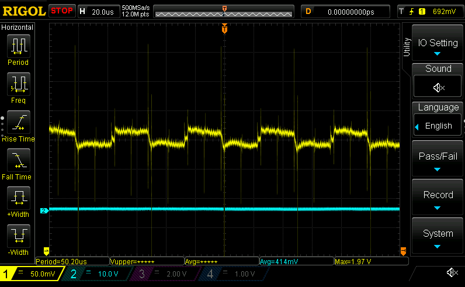

# Measuring inductances

So figured out why my current loops were all wonky. Turns out my [loop variables](./20210819.md)
weren't being handled correctly. :facepalm: On the plus side, my current measurements look somewhat
close to my [Falstad
simulation](https://www.falstad.com/circuit/circuitjs.html?ctz=CQAgjCBMCmC0AcIAskB0AGArATgMxKXTEnV3l1ymxExvRrjDACgB3ZeepbANhF0yRkvEOmZge9HoWQSaBWX3roM6IuDWatY9kk7I18pAeXMANiGlc5AdnTGkc5arU3RqAbh7EkuG-EhIeDB-NzEAJxA7B1tBRVF3SDYouO4+TAU00WSMhxE9LhExACUabCFfIRwhASF6Cq0aBOdsCR527S0WdlzhdMzcOuYAc35UkVqaIObkm1TYiqLmUoKTZEG1+qhGyGNld0xmAHsNEER6AA9yIkoVTQgVPxDcLDnW4iZqLbu1Wnowei3VB-Y78M4JQjYagyXCoOpQMG4ZhAA)
when toggling at 20kHz (yellow trace is current):

And the current measured across the resistor, toggling phase A high B//C low, then vice versa:

So trying to generate a square wave now, but it looks like I'm losing a variable inside of a closure
somewhere...
- I set `let mut sign = -1f32` before the control loop, and do a `sign = -sign` to invert it every iteration
- Oddly, by the time it gets into the loop, `sign` is `0` ?!
- I wonder if this has to do with how I'm munging the callback in the `IRef`, potentially blowing away the vtable
- Okay, initially the memory address of `sign` is `0x20017fcc`, and inside the loop it's... `0x20017fd4`. That doesn't seem right
- But if I assign it to a `static mut`, the location goes back to `0x20017fcc` as expected...???
- Sounds suspiciously like UB
