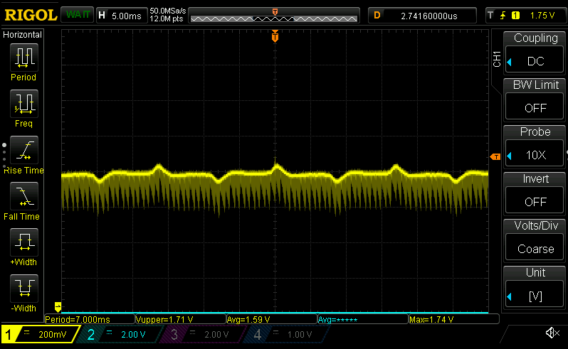

# Proper ADC reading

I've gotten pretty far just using the raw ADC peripherals, but I think it's time to make a small current sensing wrapper that has access to all the ADC bits we need.

I keep trying to re-invent the HAL. I see useful Rust-isms, but I really gotta focus on getting the BLDC control done before going all Rusty...

Okay, got ADC up and running. All you have to do is `current_sensor.sample()` and it'll return an `f32` voltage for `v_bus`, and a _calibrated_ phase currents for 1/2/3. Needs some cleaning up, but good enough for now.

I'm seeing fluctuations on the phase currents of around 0-0.18A. In the grand scheme of things this shouldn't matter too much, but I wonder how much more accurate I can get (need?). Let's try bumping the sampling period up a bit.

Not a whole lot of difference going to 12.5 samples. how about 24.5... That gets it down to about ~0.06A, which is actually a lot better.
- Unfortunately that lowers our available control loop time from 12.5uS to 11.6us. Not too bad of a loss, but still, when every microsecond counts...
- I wonder if this can be avoided by only sampling for a longer time period during calibration...? Nope.
- This may _also_ be due to the fact that my switching power supply doubles as a [vuvuzela](https://www.youtube.com/watch?v=bKCIFXqhLzo) for all the noise it makes...

***sigh***

Pretty sure I just need a better power supply. Here's a _grounded_ probe of `sense_a` line:

And yup, the rail line looks like that too. Just can't get my Rigol scope to get a good a pic of it, but it's definitely there. And when you're measuring ~10mVs or less that counts. That's a good +/- 40mV
