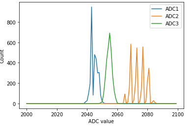

# Current (non)sensing

Hooray for a new [Riden RD6018 power supply](https://www.youtube.com/watch?v=y_TAnfTYa6I)! (not me :) No more awful 60Hz noise. Still some switching noise in the 60~70kHz range at low frequencies, but that should be okay for now.

Something is a bit off about my current sensing. On the scope I'm seeing pretty rock-solid sense traces between PWM pulses:

That's 1.54v on phase A, and from the DRV8323R spec, we get $I=\frac{\frac{V_{vref}}{2} - V_{SO_x}}{G_{CSA}\times R_{SENSE}} = \frac{\frac{3.3}{2} - 1.54}{40\times 0.001}=2.75A$. But the ADC is reading something like -1.371A (???).

I implemented a calibration step during current-sensor bring-up, but maybe I've got a bug there?
- I suspect it might be something wrong in the ADC calculation, like I've got $v_{refint}$ where $v_{refint\_val}$ or $v_{refint\_cal}$ should be...?

Probing around, it looks like - at least initially - ADC1 is spot on. But ADC2 and ADC3 are reading a bit high (0.5% and 2% respectively). Let's look at the affect of ADC1's readings as a function of v_refint:

All the readings are a bit high for the range. Let's see if we can get a sense of how much/where the noise is...
- ADC distribution of 3k samples:

  

- ADC2 looks kinda weird, but seems okay overall
  - Almost looks as if it's not actually 12 bit?
  - Could also be noise on the DRV8323's output lines; possibly inductive coupling in the PCB
- I should look into the DRV8323's calibration routine...
  - Going to try calibrating each CSA one at a time. No difference
  - Going to try calibrating each CSA for longer. No difference
- How about we just sample for longer?

  

  - Weird. I mean the ADC1 looks fine, albeit with a bit of a median shift, but the distribution itself doesn't change
    - Means I can just do an initial offset calibration
  - @skoomadentist from [Amulius](https://discord.me/amuliusengineeringchill) suggests it might actually just be a 10-bit ADC due to the DNL:
    

  - Tried oversampling. A lot better at 4x:

    

    - I don't like losing the 240 samples of the scant 2125 available every cycle. Will try to avoid that if possible
- Let's probe the sense lines
  - Note to self: add a via to probe all current sense lines on the next rev, not just A and C
  - Phase A:

    

  - Phase B:

    

  - Phase C:

    

... Oh. The ADC seems to be working fine. There's something weird with Phase B. Could there be some coupling with the sense lines or something?

Okay, going to ignore the super high frequency noise for now and see if I can get some sane readings.
- Seems like there's some odd dynamics on starting conversion
- Wonder if I have to take the $t_{SET}$ here into account: at 40V/V the time is 1.2us (!)

  

  - Not clear what $V_{O_STEP}$ is in this case. Guessing? If the $V_{sense}$ voltage jumps half a volt, this is how long it'd take the amplifier to get to the right output.
- So it looks like the most accurate calibration is _not_ to use continuous, but to trigger a calibration manually via software
  - This is analogous to the ADC idling until `tim_trgo2` happens. I don't have a good scope of this happening, but given I see a ~10-15mV difference in the `SENSEx` lines between continuous and single-shot mode I'm fairly confident this is what's happening.

_Side note: The 2.84/2.85MHz noise is really annoying, but something tells me it's due to the new switching power supply I'm using. Will look into that later_

  - With this setup I'm now seeing <= 100mA of noise, usually right around ~50mA centered around zero
  - Occasional spikes into ~200mA, but oversampling in the controller - something I'm learning about in [control theory boot camp](../control%20theory%20bootcamp/../control%20theory%20bootcamp/part01.md) - can likely make this level of noise pretty much moot.
  - Pretty happy overall now with the phase current senging. Still kinda leery about that noise on `SENSE_B`, but can live with it for now.
