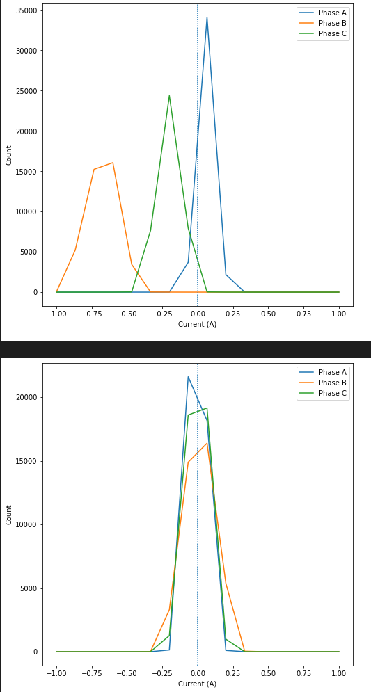
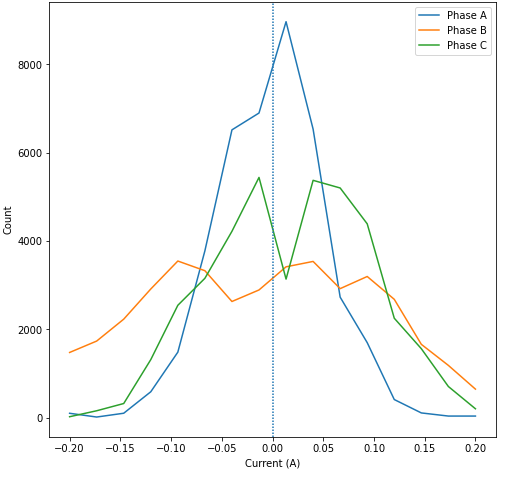
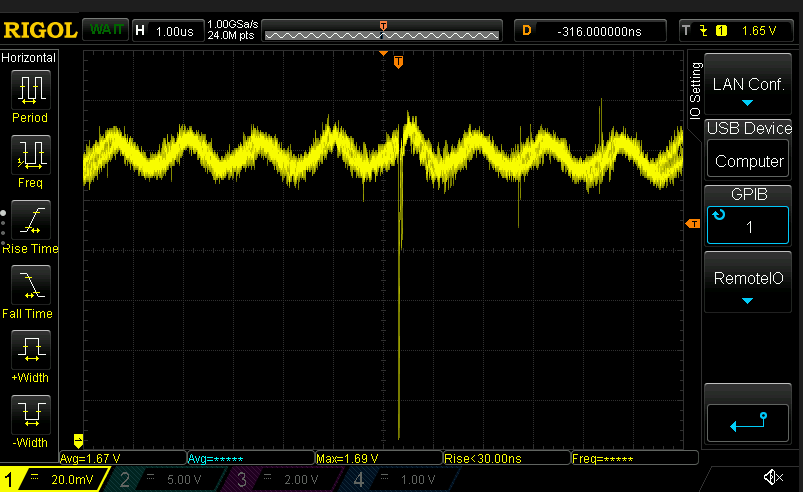
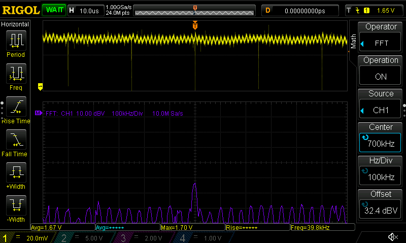
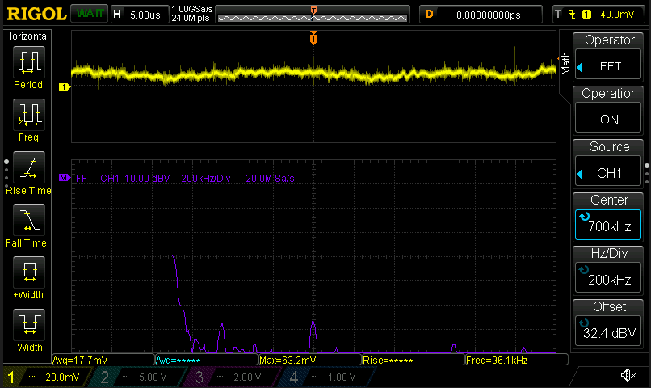

# The Case of the ~~Missing~~ Noise

This ADC noise is really starting to bug me
- First up I moved calibration to be done via a `ControlLoop`, currently triggered via RPC
  - Probably can set this during startup, but for debugging purposes this is fine
- Before/after calibration:

  
  - Pretty cool that I can do this via Python now
  - Looks pretty good, but then there's still some wonky noise on ADC2:

    
- Okay, I just convinced myself it's switching noise. Here's a trace of Phase B's sense line:

  

  - And guess what? If you zoom out a bit and do an FFT...

  

  - Ayuuuup. 700kHz. And guess what the switching frequency of the DRV8323R is... :woozy_face:

- Here's a probe between the 24V ground and the logic ground:

  

  - No getting rid of it on this board revision :(

Turns out I made a major screw-up when designing this board revision: I split the ground plane
- It's apparently [one of the worst things you can do](https://learnemc.com/some-of-the-worst-emc-design-guidelines)
- Pointed out by @SkoomaDentist in [Amulius](https://discord.me/amuliusengineeringchill)
- Nothing I can do about it now. Hopefully the controller will be able to deal with it :/

Okay, next up: reorganize the commutation folder a bit. Done.
