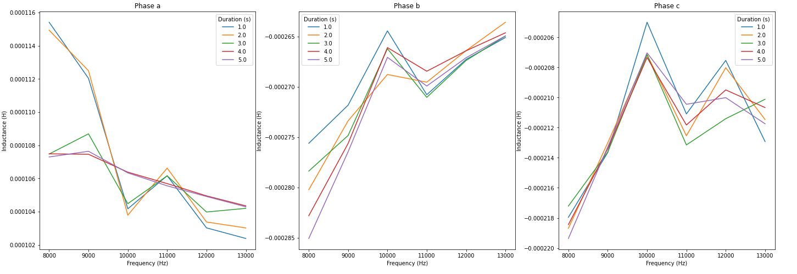

# The Case of the ~~Missing~~ Noise

This ADC noise is really starting to bug me
- First up I moved calibration to be done via a `ControlLoop`, currently triggered via RPC
  - Probably can set this during startup, but for debugging purposes this is fine
- Before/after calibration:

  
  - Pretty cool that I can do this via Python now
  - Looks pretty good, but then there's still some wonky noise on ADC2:

    
- Okay, I just convinced myself it's switching noise. Here's a trace of Phase B's sense line:

  

  - And guess what? If you zoom out a bit and do an FFT...

  

  - Ayuuuup. 700kHz. And guess what the switching frequency of the DRV8323R is... :woozy_face:

- Here's a probe between the 24V ground and the logic ground:

  

  - No getting rid of it on this board revision :(

Turns out I made a major screw-up when designing this board revision: I split the ground plane
- It's apparently [one of the worst things you can do](https://learnemc.com/some-of-the-worst-emc-design-guidelines)
- Pointed out by @SkoomaDentist in [Amulius](https://discord.me/amuliusengineeringchill)
- Nothing I can do about it now. Hopefully the controller will be able to deal with it :/

Okay, next up: reorganize the commutation folder a bit. Done.

Now to the inductance measurement
- Since there is no current control in this loop, the PWM duty cycle is hard-coded to be no more than 0.03, which at 24V and a winding resistance of 0.2R yields 3.6A. The windings I'm using are rated for 8A continuous and would very likely be able to handle much more, but I don't want to fry anything right now :)
- I first need to make sure the ADC is calibrated properly, which is its own `ControlLoop`
  - Kind of in an awkward spot as to when `ControlLoop.finish()` is called
    - Right now it's called from the interrupt _immediately_ after the control loop is finished
    - Works okay for now, but it does mean I can't chain commutators easily :/
  - Stopgap is to enforce that calibration happens on the driver prior to it entering the run state.

So I think I might have something sane? I'm reading 160μH which seems somewhat in the ballpark. Let's check the current traces
- First I should set it up to be triggered from python so I don't have to keep re-flashing.
- That works, but now release mode is getting stuck on `adc5` coming out of enable state?
  - It's sleepy, apparently. Needs a few microseconds to get out of calibration mode?
- Looks like the measurement is close to working, but it's not respecting the flipping; seems to be flipping every commutation
  - Yup, forgot to clear loop variable

Hooray, I've got a singing actuator! :musical_note:
- Here goes nothing... going to sweep through a few durations and frequencies. Hope this doesn't burn up the stator
- And we have inductances!

  

  - This was done flipping Phase A high and B/C low, and vice-versa, switching the polarity of the square wave voltage at Freq
  - Doesn't look terribly stable, but on A (the one I'm actually calculating it on since B and C don't necessarily have the same resistances) it's a standard deviation of 1uH at the longest calibration time which is more than good enough to calculate current loop gains :thumbsup:
  - And an inductance of 100uH seems to be in the ballpark of where I'd expect it to be

_TODO(blakely): Initialize timer in control loop_

Okay, now trying to characterize the inductance
- The [falstad sim](https://www.falstad.com/circuit/circuitjs.html?ctz=CQAgjCBMCmC0AcIAskB0AGArATgMxKXTEnV3l1ymxExvRrjDACgB3ZeepbANhF0yRkvEOmZge9HoWQSaBWX3roM6IuDWatY9kk7I18pAeXMANiGlc5AdnTGkc5arWRs7j5682QsMKkxuXGwbSTBseDB4TBtEMQAnEDsHW0FFUVFUSDYktO4+QIcRHSNhPj0uYuYAJRpsISRcIRwhASF6Bq0aDOdsCR4B7S0WdkKy0sb25gBzfjyRNppIONEcmzzUhqraipNkJr2OjU0oY2VMzGYAew1LM-BINwgVTQh-GwibUJ5sRvh1nxHMD0XDXfh3DKEdwGSyoe6tfjMIA) suggests that a higher frequency implies less losses
- I saw that in _one_ graph of all the characterizations I did, but now I can't
