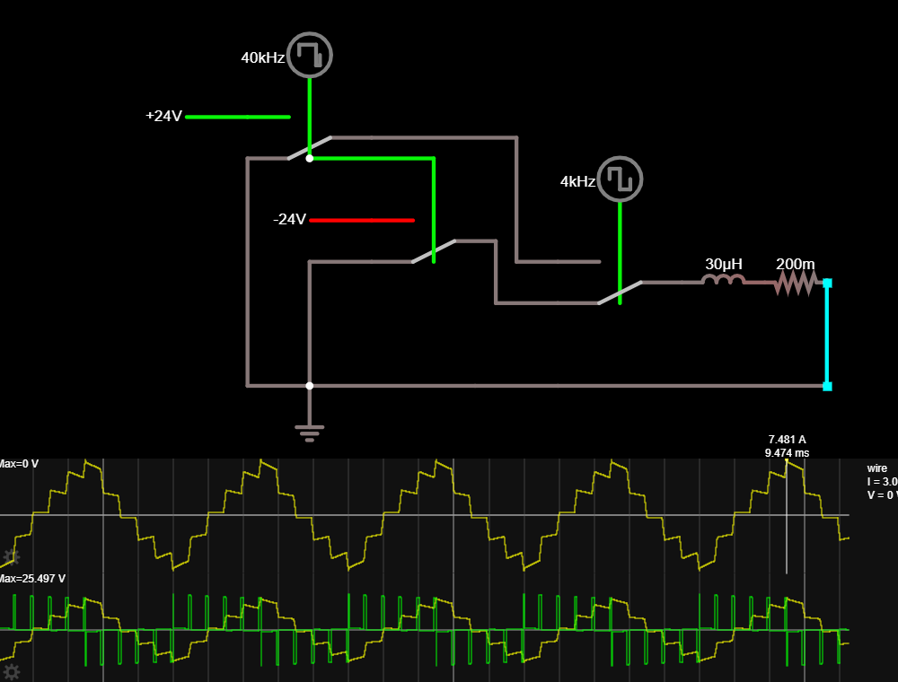
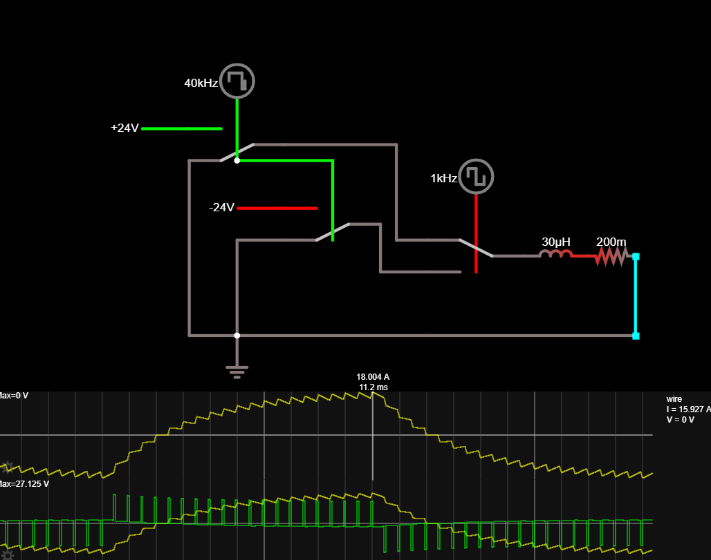
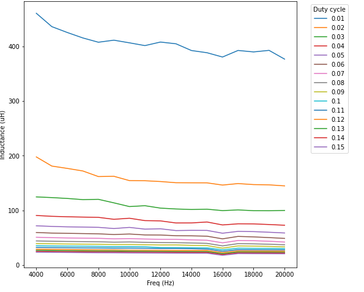
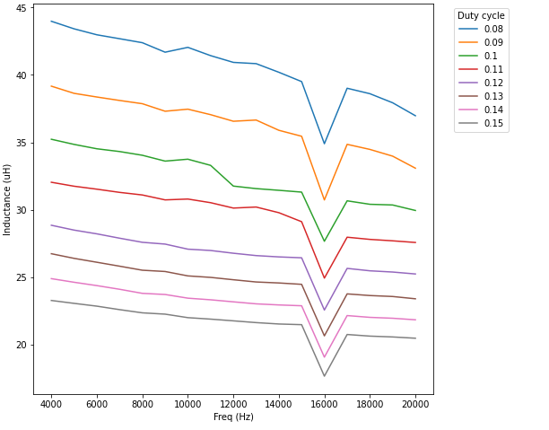
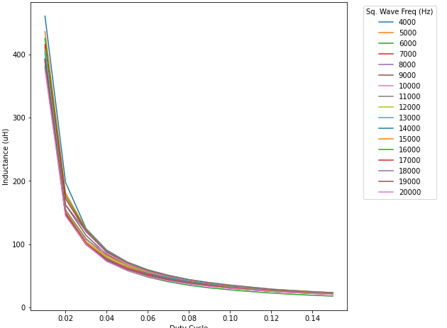
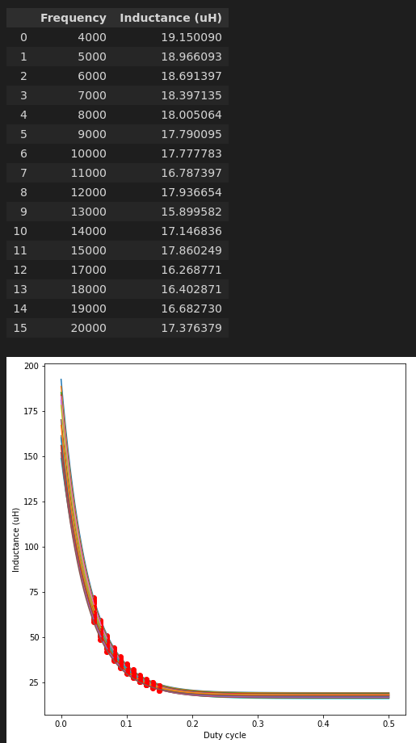
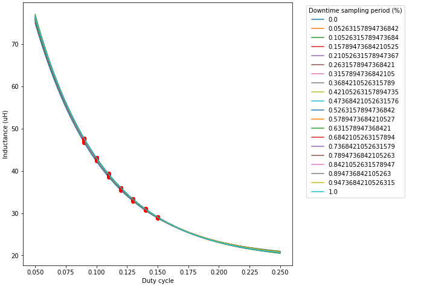
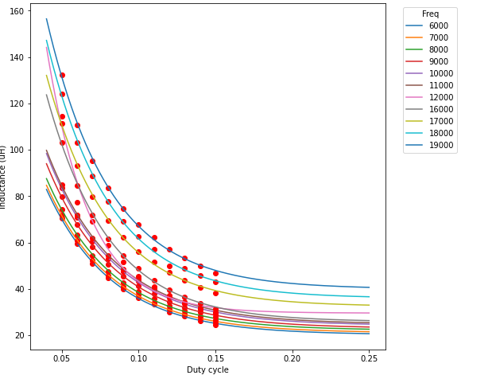

## It's the final ~~countdown~~ inductance measurement!

Okay, I'm really going to make an effort to get the inductance measurement down now. Doing a few
more parameter sweeps to really characterize it
- I'm doing voltage control via PWMing, so an additional parameter is Duty Cycle (aka Voltage)
- The inductance measurements are going to be more accurate the more voltage I put into the square wave
  - That said, I can't put a full +/- 24V across it since the coils only have a resistance of 0.2R which would be tossing upwards of... 120A through the coil. Yikes!
- So I'll need to make sure I keep the duty cycle down to something reasonable
  - The motor's rated for 8A continuous, so I figure 5s at 8A peak is fine
  - That 8A translates to about a 15% duty cycle when doing a 4kHz square wave, assuming my [Falstad sim](https://discord.com/channels/772467083370823710/772543427640295455/886714568422862858) isn't too far off
  - Higher frequency square waves should be much lower than that peak
- 15% duty cycle at 4kHz square wave

- Can't go too much slower square wave than that due to a few reasons:
  1. The peak current would be around 18A
  1. The the true triangle output wave approximation breaks down
  1. The resistive losses during pwm-down periods get pretty lossy

  

  - The last doesn't change too much for different frequencies, but at least for higher frequencies the approximation is a bit better
- Let's see where that gets us...
  - [Let me sing you the song of my ~~people~~ stator](https://photos.app.goo.gl/AEF8fjNLeESPyhRq8)
  - And bingo! The duty cycle's affect on inductance measurement:

    

  - Aside from an interaction at 16kHz (I suspect that magic frequency does not keep the triangle wave zero-centered), it's a pretty good successive estimation:

    

  - All duty cycles show asymptotic behavior:

    
- Aaaaand... we have an inductance! Exponential curve fits for all these line up with a final approximation of 16-17uH

  

  - ... wait, that seems a bit low
- Solution: stop being a cheap-ass and buy an LCR meter :sweat_smile: (but if nothing else this is a good exercise! :upside_down:)
    - The silly part is I'm spending way too much time on this. I'm literally using the same stators as Ben did, so I could just use his 30uH measurement...
    - But... _whyyyyyyyyy_ did he use that value?! :rofl:
- Aha, here's something... I think I was sampling too late in the ADC cycle; I originally was sampling in the PWM deadtime like you're supposed to do for FoC, but that's much later compared to the PWM square wave
  - So it turns out sampling period doesn't matter nearly as much as I thought it would...? I guess that's good?

    

  - That's varying the position of the sampling trigger, where 0.0=sampling immediately on the falling pwm edge, and 1.0 is measuring in the dead center of the PWM downtime
  - On the one hand that's nice to know that there isn't too much noise on the ADCs that the exact time of sampling doesn't matter too much
  - On the other hand, I'm getting asymptotic inductances of like ~20uH, which is much less than Ben had (he measured 30uH)
    - (Caved and bought an LCR meter; supposedly arrives Friday, so I should have some ground truth soon-ish :sweat_smile: )

Okay. So gonna call it "okay" for now
- I've figured out the variables that affect the inductance measurements, and with an "optimal" 2s testing time I'm seeing a whole bunch of reasonable measurements that suggest this motor is right around 24-26uH, which is about an order of magnitude better than I realistically need the measurement to be :zany_face:

  
