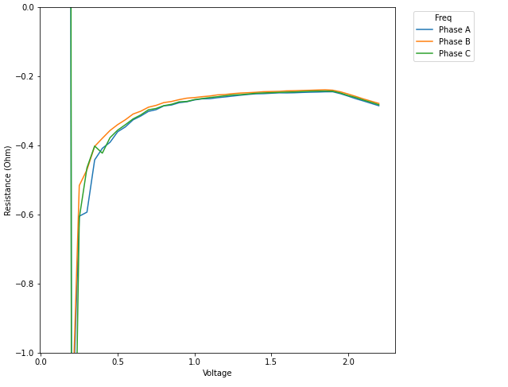
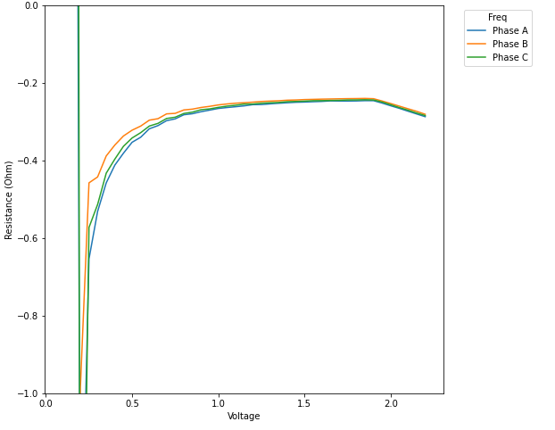

# Easy goal: measure resistance

Hopefully a quick goal this evening: measure the phase resistance for phases A/B/C

Less quick than I'd have hoped since I was getting some slightly odd values of 330+ mOhm, but got it
sorted
- _On tonight's riveting episode of "Graphs Nobody Should Care About" we bring you... phase resistance!_

  

  - Looks like I'm measuring around ~240 mOhm asymptotically
  - The end dip is my ControlLoop hardcoded limit of 0.08 duty cycle kicking in
  - Note that this is sensing for only 0.25s. I can probably get a slightly more accurate reading if I sensed for longer
- The motor manufacturer claims they can sustain 8A continuous, but a) that almost certainly has to be over-estimated by a decent margin and b) given the global silicon + supply chain armageddon I reeeeeeeeeeeeeeeally don't want to destroy one of my <= 3 actuators I have for the next 1-5 years D:
- You know what, here goes nothing. Going to try to measure for - ***gasp*** - 0.5s. Will report back either with results or very-angry-at-himself-for-knowing-his-luck-gonna-wreck-his-stator-Timmay...
  - Reporting in: neither my stator nor house are on fire :fire:
  - Again, very similar response:

    
  - Asymptotically it's right around 240 mOhm yet again
  - 240 mOhm is right in line with what I can measure with my multimeter across a single phase: 0.1<R<0.2 Ohm

Okay Tim, STAHP characterizing the motor already!
- We have inductance and resistance of the motor now
- We can pass it on to Future Tim to design the current control loop gains
