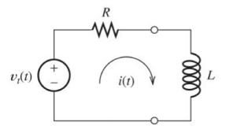
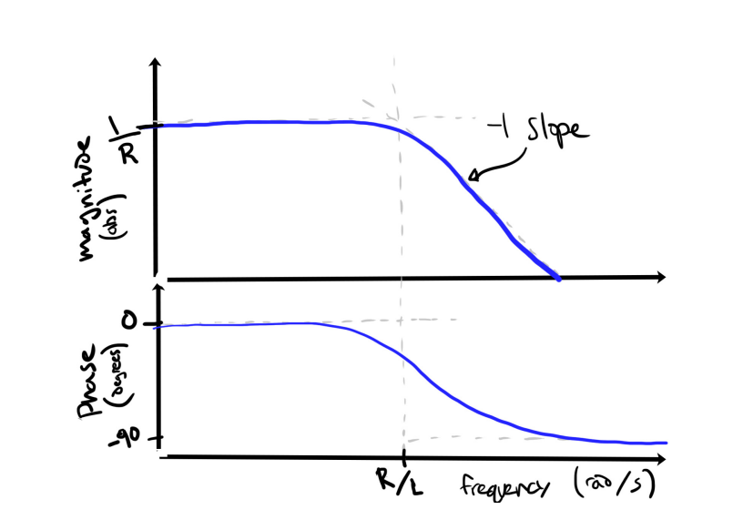
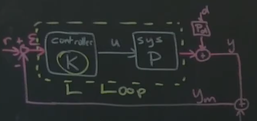
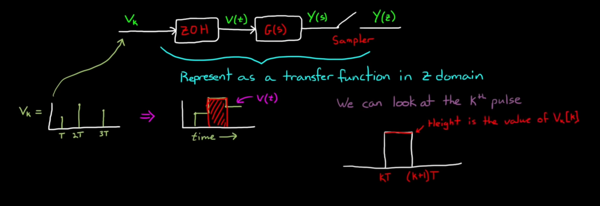
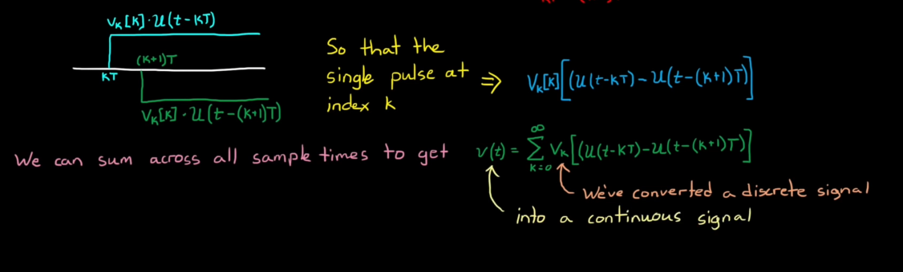
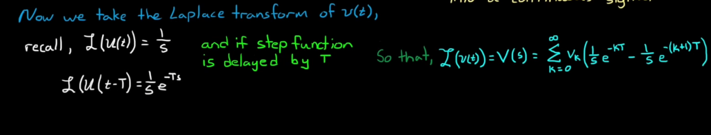
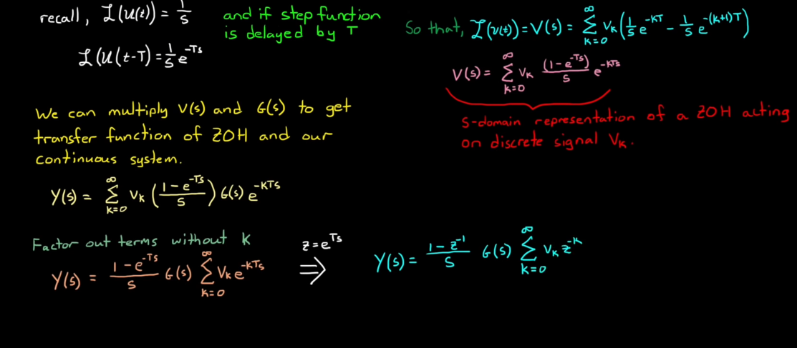
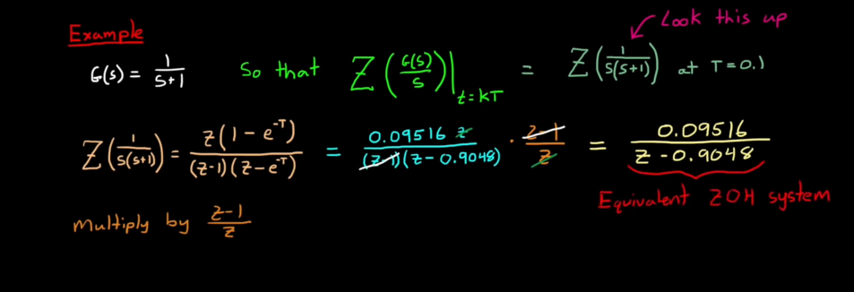
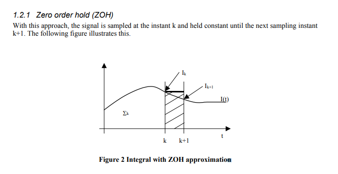

# Current loops

Working on figuring out the current gains on the following assumptions:

- Inductance: 24-26 $\mu H$
- Resistance: 240mOhm

Going to work through Ben's model, Appendix C from this thesis.
- Electronic dynamics of the system (RL) are several orders of magnitude faster than mechanical, so reasonable to ignore those dynamics

  
- Continuous time _system_ transfer function is $\frac{\bar{Y}(s)}{\bar{u}(s)}=\frac{I(s)}{V(s)}$
  - $V(t)=\underbrace{L\frac{dI}{dt}}_{inductor} + \underbrace{RI(t)}_{resistor}$
  - Laplacian gives us $V(s)=LsI(s)+RI(s)$
  - Building transfer function:

$$
\frac{\bar{Y}(s)}{\bar{u}(s)}=\frac{I(s)}{V(s)}=

\frac{I(s)}{LsI(s)+RI(s)}=\frac{I(s)}{(Ls+R)I(s)}=\frac{1}{Ls+R}
$$

- - Neat, derived that on my own and it matches Ben's results :)

So system transfer function is $\frac{1}{Ls+R}$
- Looks like there's a pole at $s=-\frac{R}{L}$
- Note that in the standard format the $\frac{1}{as+b}$ means it has a DC gain of $\frac{1}{b}$, or in this case $\frac{1}{R}$ ([good resource](https://www.allaboutcircuits.com/technical-articles/understanding-transfer-functions-for-low-pass-filters/))
  - DC gain is the $abs$ gain in Ben's bode plots

    
- Keep in mind that this is the _system/plant_ transfer function, not the true _loop_ transfer function that includes the controller $K$

  
  - That means the whole loop transfer function of the whole system is $L=PK$

Note that $\frac{1}{Ls+R}$ is in _continuous_ time, and that's not where we operate; we're in discrete
- Conversion from continuous to discrete via [z transform](https://www.youtube.com/watch?v=14cMhrp5wlk&list=PLUMWjy5jgHK0MLv6Ksf-NHi7Ur8NRNU4Z) ([neat visual representation](https://www.youtube.com/watch?v=acQecd6dmxw))
  - $\mathcal{Z\left(f[k]\right)=\sum\limits_{k=0}^\infty}f[k]z^{-k}$

  
  
  
  
  

Ben used a zero-order-hold conversion to discrete time

  

  ([source](https://www.analog.com/media/en/technical-documentation/application-notes/PI_ctrl.pdf))

  $U(z)=K_p\cdot\left(1+\omega_{pi}\cdot\frac{}{}\right)$

  $\liminf\frac{1}{x}$
