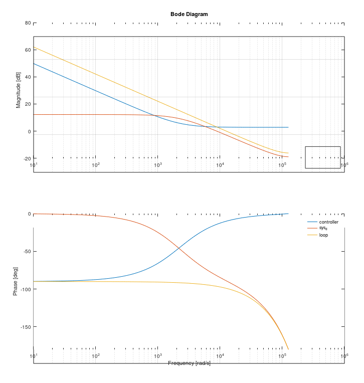

# Designing the current control loop

**Man** do I appreciate how thorough Ben was in his thesis. It's been incredibly helpful in my
learning of ... basically everything I'm trying to learn? :sweat_smile:
- That said... definitely found a few errors in it by now
- Turns out the Bode plots he showed in his thesis didn't actually match what his code in Appendix C suggested
- (also, `l` in his Appendix C doesn't exist in his code, but that's just being nit-picky :upside_down: )

But I did finally manage to reproduce the paramters he used to generate his Bode plots in appendix C.2

  
