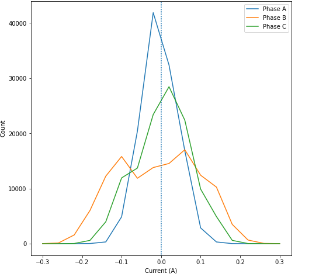
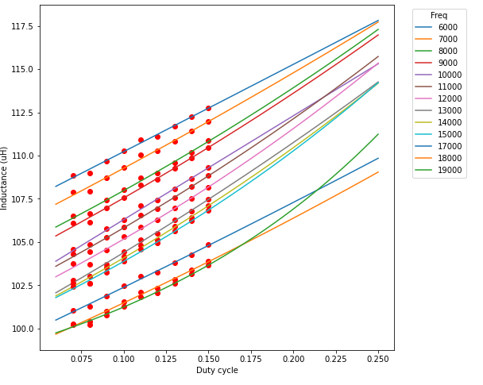

# Bad inductor, bad

Hm. Well, looks like I'll have to dig back into the inductance calibration code again :/
- On one hand, hooray my LCR meter came today!
  - AFAICT it's a not-entirely-terrible cheapo LCR meter that trades a crappy updates-once-per-second display for somewhat accurate internals
  - It's not a great one by any means, but I've tested it against a few Cs and Ls that have a known-ish value and it's surprisingly accurate
  - [DE-5000](https://www.amazon.com/gp/product/B00S298KJO/) - Amusingly even the instructions were in Chinese
  - It's a step up from the typical craptastic LCR meters since it does variable frequency measurements at  100, 120, 1k, 10k, and 100kHz
  - Still definitely better than the ~$35-range ones
  - One positive: it can measure DC resistance down to 1/100th of an ohm, which is nice (two (three?) orders of magnitude better than my decent multimeter)
- On the other hand it's measuring an inductance of ~100uH whereas my calibration routine above said it was around 25uH :thinking:
- Being close is fine, but being off by a factor of 4x is Not A Good Thing™️
  - Dang... was hoping to have solved the inductance issue

The inductance measurement from the LCR of 100uH was phase-phase, not overall
- I suspect it's due to a bug or two in my inductance measurement code. At this point - considering I've already found one bug - I trust the LCR more than my calibration code
- Given the square wave I was driving through the stator was going through A and out B and C, that means I've got a few in series
  - Which means each individual phase is < 25uH I was measuring...
- Yeah, something isn't quite right :/

I was initially thinking I wasn't doing the ADC conversion correctly
- But the v_bus rail I'm reading through ADC4 shows... wait for it... gotta remember how to do it :sweat_smile: ....
- 23.91V. That does seem a bit low, given the PSU rail output is almost exactly 24V
- But I don't think a 0.375% error can make a 4x difference in inductance measurement...?
- Just really wish I hadn't screwed up the ground plane... really going to limit my current loop bandwidth with how noisy phase B is :/

  

***sigh*** And yet again, turns out very likely [PEBKAC](https://en.wikipedia.org/wiki/User_error)
- `let v_ref = v_bus * 0.03; #PWM hardcoded to 0.03` ***Not if it's a parameter you're sending now that you've changed the loop to be configurable via FDCAN!!!*** :woozy_face:
- TL;DR: Timmay is a dummy... turns out when I correct that hardcoded value above to the correct PWM'd value I get anywhere from 100-112, which is exactly what the LCR meter suggests it should be
- 
- Silver linings? 1) My inductance calibration now works (ish) 2) I have zero buyers remorse from the LCR meter :zany_face:
