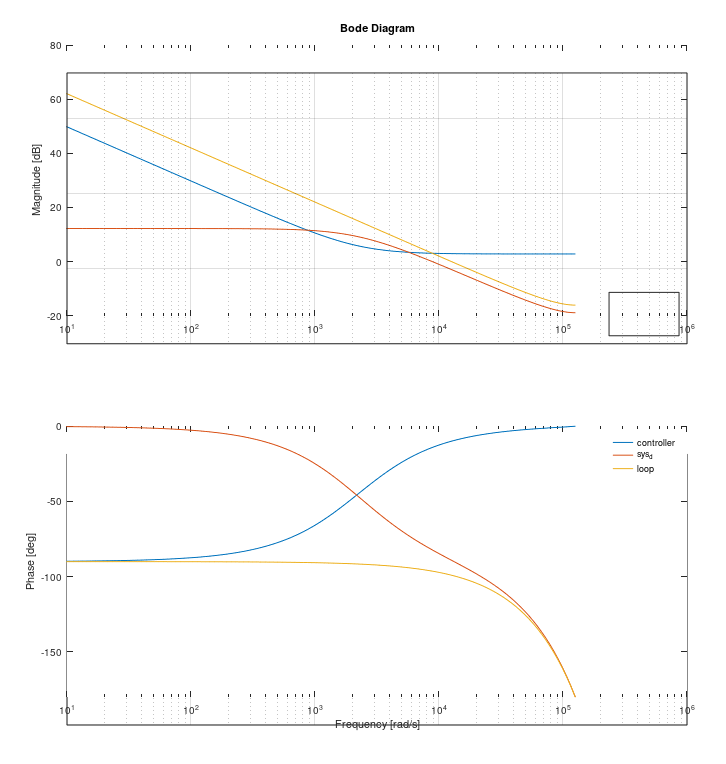
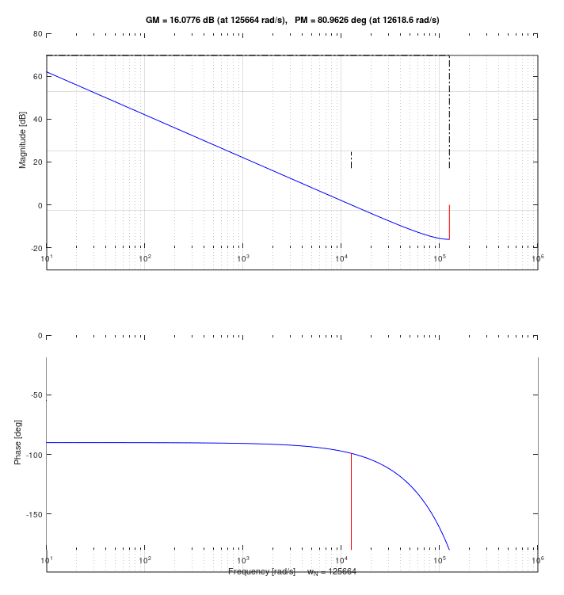
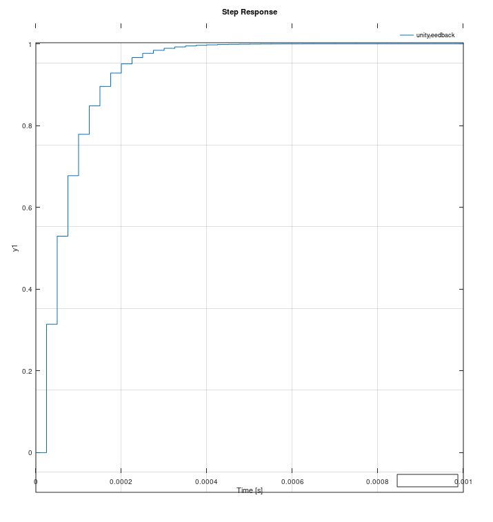

# Current control loop design

Okay! I think, after ~~a few days~~ ~~weeks~~ _entirely) too long, I think I've gotten all the
parameters set up to do my PI controller loop!
- Can now calculate the $k$ and $k_i$ values I need, and the loop gain to translate from current to voltage
- Here's a bode plot (please do ignore Octave's terrible UI) of the control parameters I've measured

  
- That's with a loop bandwidth of 2kHz (and a PWM/sensing loop of 40kHz)
- Given my awful ground plane goof, I'll probably lower that to something like 1.5-1kHz
  - Makes up for the fact that there's a tiny vuvuzela blasting its little heart out at 700kHz on Phase B :trumpet: :woozy_face:
- Decent phase and gain margins too

  

I realize I'm just going through the motions here with regards to control theory
- Any quad motion/feedback that's likely to happen in a physical system is almost certainly going to be an order of magnitude lower than the loop bandwidths I'm targeting
  - It's mainly about some blend of "trying to understand what's going on" and "trying not to asplode anything since I barely know what I'm doing", in just about equal parts :sweat_smile:
- Step response going from 0-1A on the theoretical controller

  
