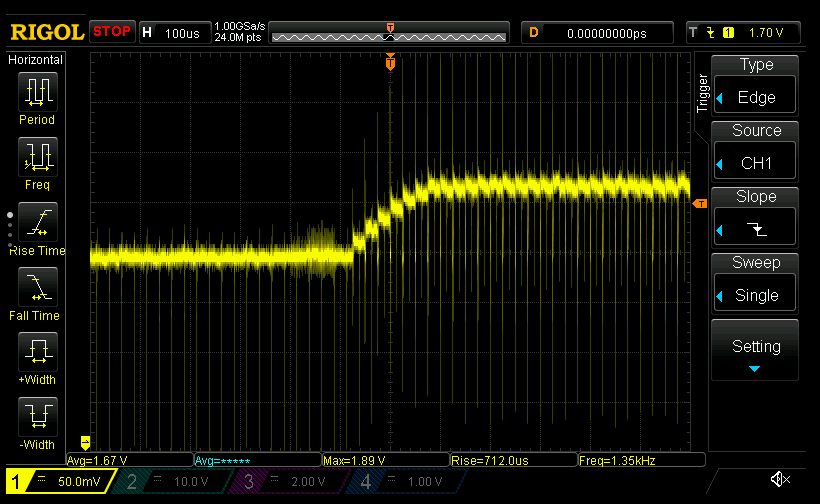
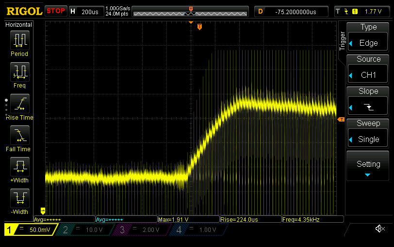
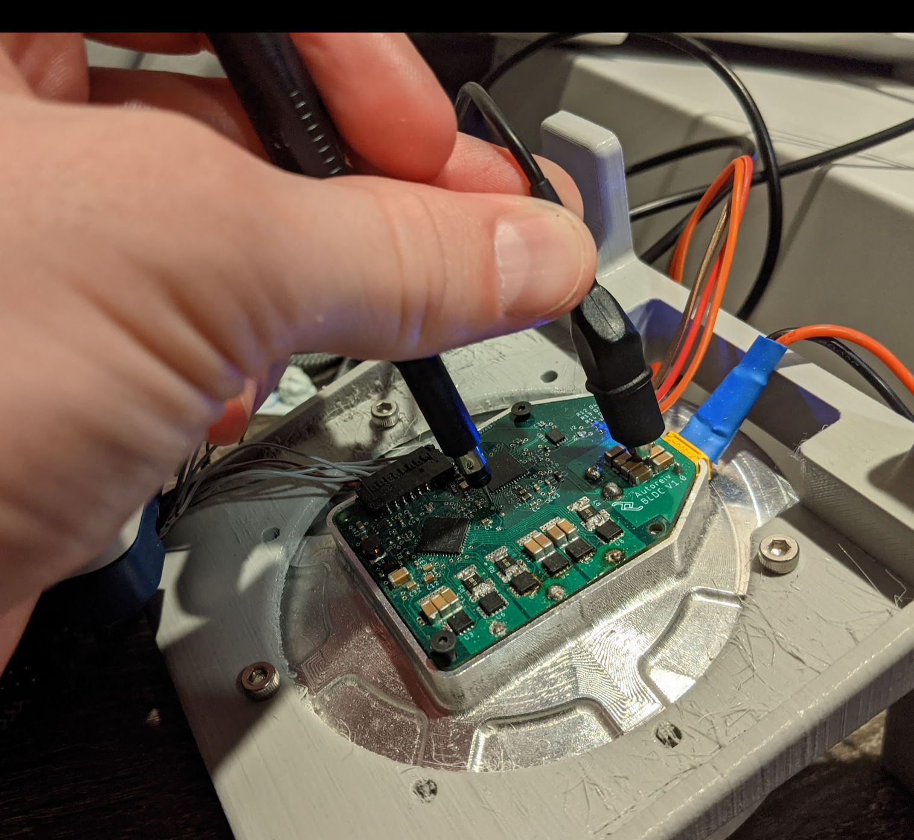
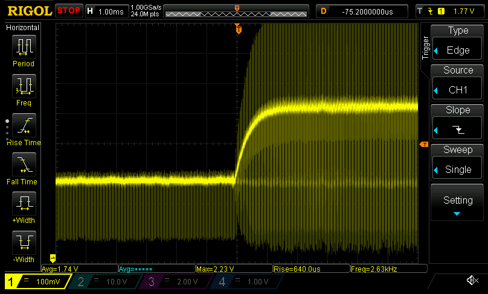
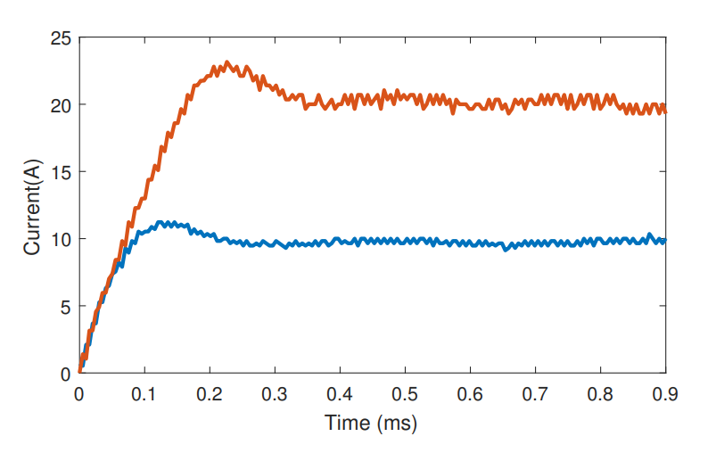
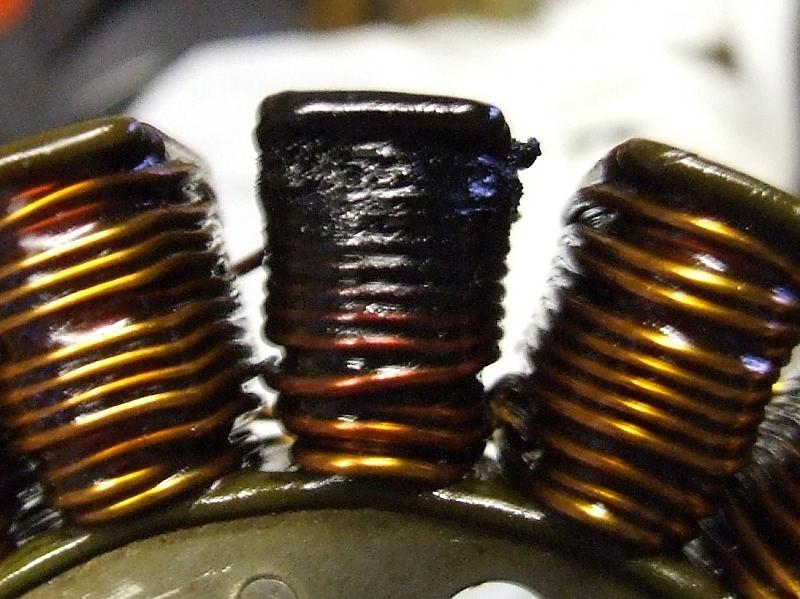
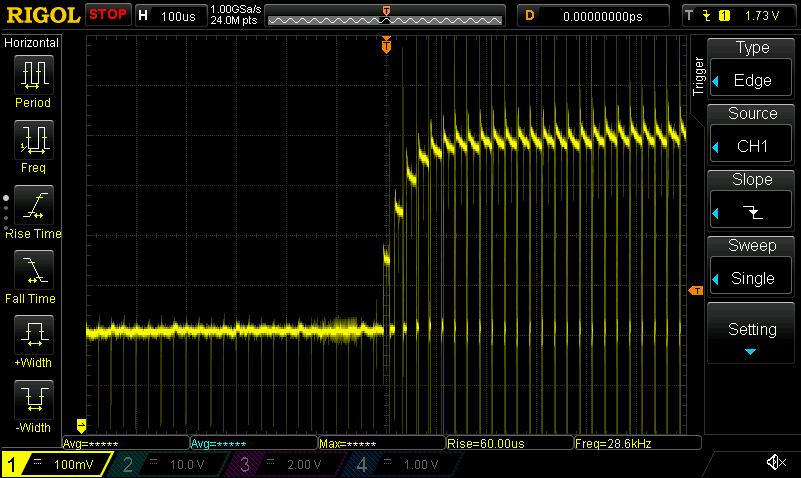
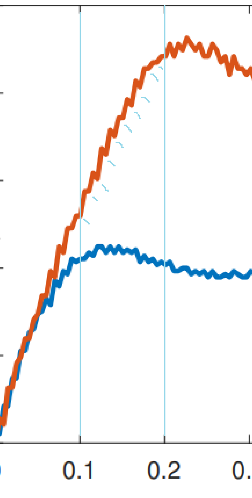
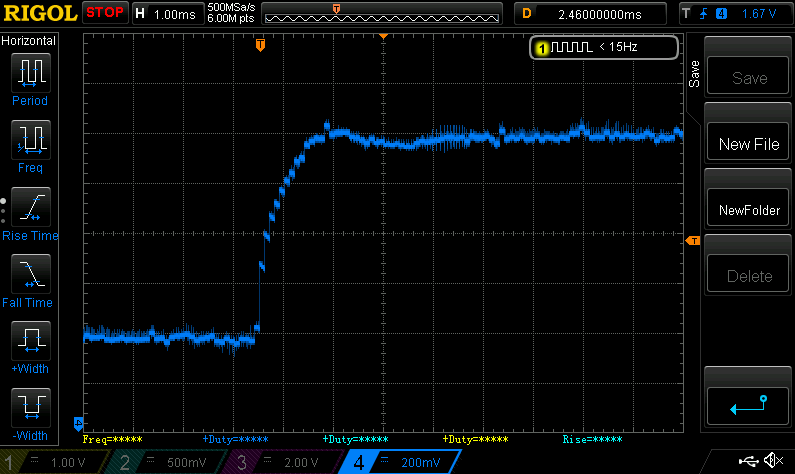
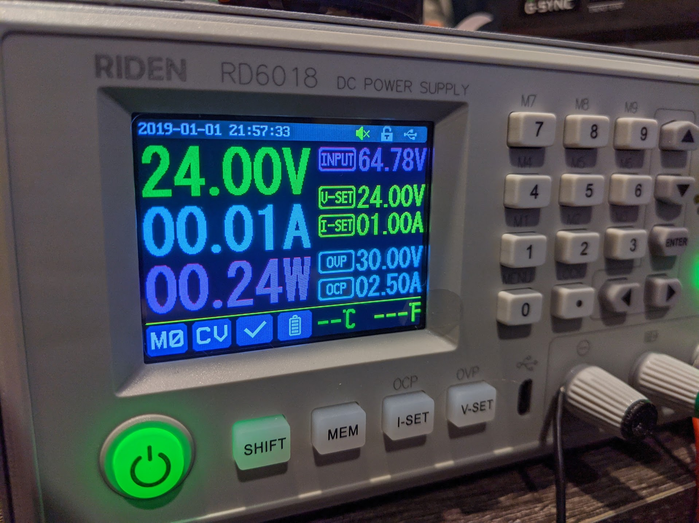

# Controlling the currents

We have current control! :zap:
- Took me a while to realize what the issue was that was causing runaway current after about 20 timesteps
- But realized by PWMing phase A to get a current on phase A, the current measured is actually negative
Makes it hard to reach a positive current... :sweat_smile:
- Now to implement rudimentary FOC and we should have some motion!

So it's _really_ noisy due to ~~my boneheaded mistake~~ issues with the ground plane, but it looks like I have current control for sure
- Here's me commanding -1.5A on Phase A, as measured from the output of the DRV8323's CSA

  

- And here's the response asking for -3.5A

  

  - Ugh, that noise is going to drive me absolutely _nuts_ until the global semiconductor shortage is over and I can actually fab new boards
    - Which will be approximately.... never? :sob:

- If you squint really hard though, there's actually a control loop there that looks just about what I'd expect given my modeling
- On top of that I don't really have a good place to ground my probe, so I'm literally steady-pinky-holding the ground clip to the negative side of my bulk caps, which I'm sure is great for noise suppression...

 

  - Why yes, now that you mention it I _am_ going to be 1) adding a ground pad to clip onto on rev 1.1 and 2) getting a proper PCB probing setup when I finally move to a workshop bigger than a shoebox
    - Please don't judge me too harshly on my SMD soldering skills... this was my first board design, SMD soldering attempt, use of 0402 parts, flux, and a heat gun ever (honestly I'm gobsmacked it turned on at all)
  - You better believe I'm going to be upgrading the I-can't-believe-it-hasn't-broken-yet debug header/wiring for rev 1.1 :zany_face:

So here's something interesting... I was wondering why I was seeing some nice, smooth current control curves like this commanding -6.5A on phase A

  

- That definitely looks like a controlled rise; all good!
- But the rise time to peak was 1ms. That's borderline "wait, [wat](https://www.destroyallsoftware.com/talks/wat), that's pretty slow, and way too slow during any kind of gait to be changing torque targets"
- This is in contrast to Ben's controller could hit the appropriate currents in <= 500us

  

# ***SIGH***

I had Forgotten yet ***another*** hardcoded value I added to the codebase
- Back when I was doing inductance and resistance measurements/calibration, I couldn't allow the PWM to get higher than a certain value or risk driving 100A through my stator
  - Just trying to prevent this (not mine, thankfully!)

    
- With that hardcoded value my current loop was clamped to driving a maximum of +/- 1.5V in case the current loop didn't work
- Remove that and lo and behold: I can hit 0->10A in just over a hundred us, just like Ben's case above

  

  - Note that his simulations above are running faster than the 40kHz my measurements are made at. From what I can tell from the graph above the motor sim is running at a loop speed of 100kHz

    
    - (That's 10 ticks per 100us)
  - He had a (much) older control loop running at around 10kHz that reached a step function of 1A in about 1.55ms, so this seems acceptable

    
- Again, my k/ki are probably way needlessly accurate, but hey, can't complain with a bit more performance

Last amusing anecdote for the evening
- Was wondering why I couldn't get above 16A on my current step
- ... turns out I had yet _another_ (***are we seeing a pattern yet Timmay?!***) hardcoded limit that said if the board detected a current above 20A to shut down
- So considering my amplifiers are a bit noisy and there's probably a bit of overshoot for the control loop, I added a low-pass filter on the phase current (`alpha = 0.01`)
- ***BBZZZZTTTT*** aaaand my psu started going nuts
  - ... oh, I had the current limit set to 1A and OCP set to 2.5A. No wonder it couldn't supply 16A :zany_face:

    

Alright; TL;DR for today:
- I have current control, and didn't blow up my stator getting to this point :sweat_smile:
- In addition to that: my inductance calibration + resistance calibration + control loop gain calculations were accurate enough to effectively auto-tune a control loop for 2kHz bandwidth! :tada:
- Just a few more steps away from FOC commutation
