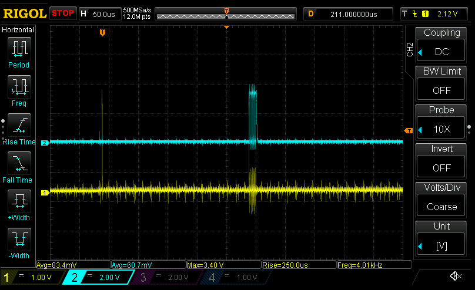
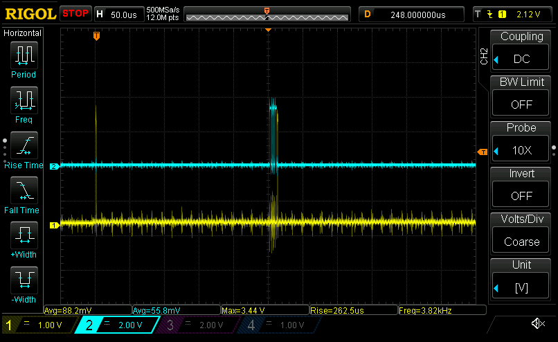
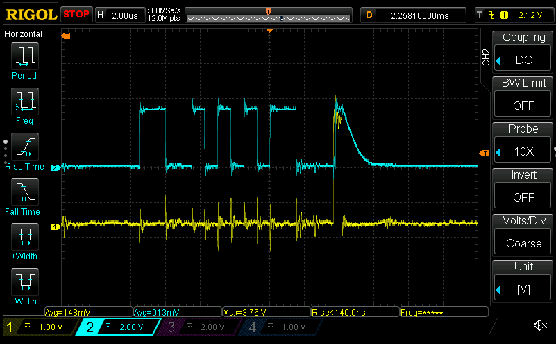
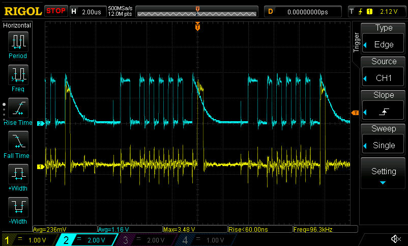

# Encoder angle

Time to get electrical angle and velocity
- MA702 is already being auto-polled at 1kHz
  - Datasheet suggests new data is added to SPI every $1\mu s$
  - Doesn't really produce data changing that fast though since there's a ~390Hz filter cutoff frequency
- The stator has 12 poles, which gives us an electrical resolution of
  $\frac{2^{12}}{12}=\frac{4096}{12}=341.333$ ticks, or just over 8.41 bits

So how to deal with time...
- I've got three distinct time intervals:

1. The control loop of 40kHz (25us)
1. The MA702 polling loop via SPI of 1kHz (1ms)
1. The digital filter on the MA702 with a cutoff frequency of 380Hz (2.56ms)

- As far as I can tell I _think_ the last is accounted for with time delays in the control loop
- I can get the raw angle - both electrical and physical (EP) - easy enough; that's just reading the sensor
- The trick is how to calculate the _angular velocity_
  - It's required in two places: the finer grained direct EP angle via estimation, and the FOC calculations
- I think the underlying velocity calculation can probably be done within the `Encoder` struct, assuming we call an `.update(dt)` function once every control loop.

First up, get the MA702 to record velocity
- That'll require knowing the difference in time between updates. I guess only way to do that is by triggering on DMA
  - I guess I could use a timer, but would probably have to use a 32 bit timer; I'll cross that bridge when I have to
- Okay, have the DMA1 interrupt triggering
- Now I've got a bit of a problematic situation: both the DMA1 interrupt handler _and_ the 40kHz control loop need access to the result of the MA702
  - DMA1 needs it to read the encoder value and calculate the angular velocity and acceleration at 1khz
  - The control loop needs it to update the Encoder's finer grained representation via $\dot{\theta}=\ddot{\theta}dt$ and $\theta=\dot{\theta}dt$
  - I _think_ I may have conquered this problem once before via `BufferedState`. The high frequency control loop is read-only, so the lower priority DMA1_CH2

Okay, got that going. Seeing some odd readings on the raw_angle though... it's supposedly 12 bits but it's going to ~4658
- Thought it might have been garbage being written, but turns out I had `>> 3` instead of `>> 4`

Oof, running into a gotcha with buffered_state: I can't count on previous values being correct since the state is being double-buffered; the previous value would be in the other state
- Looks like I'm going to have to add one more layer of indirection to avoid blocking the control loop
- Wait, actually this works out pretty well: I can use the other buffer as the previous value since it's read-only in the `StateReader`
- Yup, that works. Now able to get the angle at 1kHz and soon interpolate it even more
- Though now that I look into it, it seems like in spite of the filter being at 380Hz, it can produce data faster than that, at up to 1MHz... so this might have been superfluous?

Working on DMA auto-transfer from MA702, but something's a bit weird...

- That first yellow pulse is when I enable the interrupt. That second yellow pulse is when the DMA transaction complete signal hits. That transfer _should_ be driven by the SPI completion
- But instead it appears to be on when the SPI transaction _starts_
  - Digging into the DMA settings now; I likely swapped `DMA[CH1]` (used to trigger the SPI transaction) and `DMA[CH2]` which is triggered by the SPI frame completion
- Aha! That's more like it

  - Zooming in:

    

  - Copy-and-paste strikes again... I had set up `DMA[CH1]` trigger correctly, but during copy/paste setting up `CH2` I didn't end up changing the DMA trigger from `TIM3_UP` to `SPI1_RX`
  - Oops? Oh well, at least it was pretty quick to fix
- Ooh, wait... since this is done via DMA I wonder if I can poll the encoder _even faster_ than my control loop
  - The DMA controller can execute a write every 4 AHB cycles, which mens at 170MHz it can run at 42.5MHz
    - Pretty overkill, since the SPI is only at like 5MHz or something like that :sweat_smile:
  - Looks like as long as I don't use the interrupt-driven version I can poll it at 100kHz and have about 4us of play assuming I run the SPI at $\frac{170MHz}{64}=2.656MHz$

    

- 100kHz is complete overkill of course since I'm only actually reading the value once every 40kHz in the control loop
  - But there's one big advantage to doing it via DMA: there's effectively zero overhead during the control loop waiting for the SPI to read out the angle
  - Even assuming you're doing it asynchronously, unless you pack various other instructions _perfectly_ between the start-SPI-read and read-out-once-SPI-transaction-is-done you're going to be wasting upwards of 1-5us
  - That doesn't sound like much, but when your control loop is operating at 40kHz that means you've got 25us _total_ to play with
